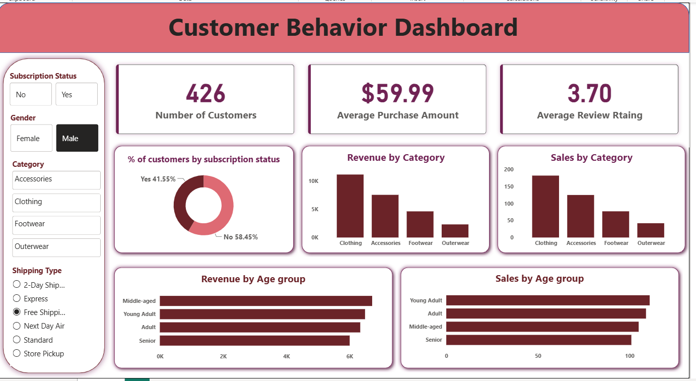
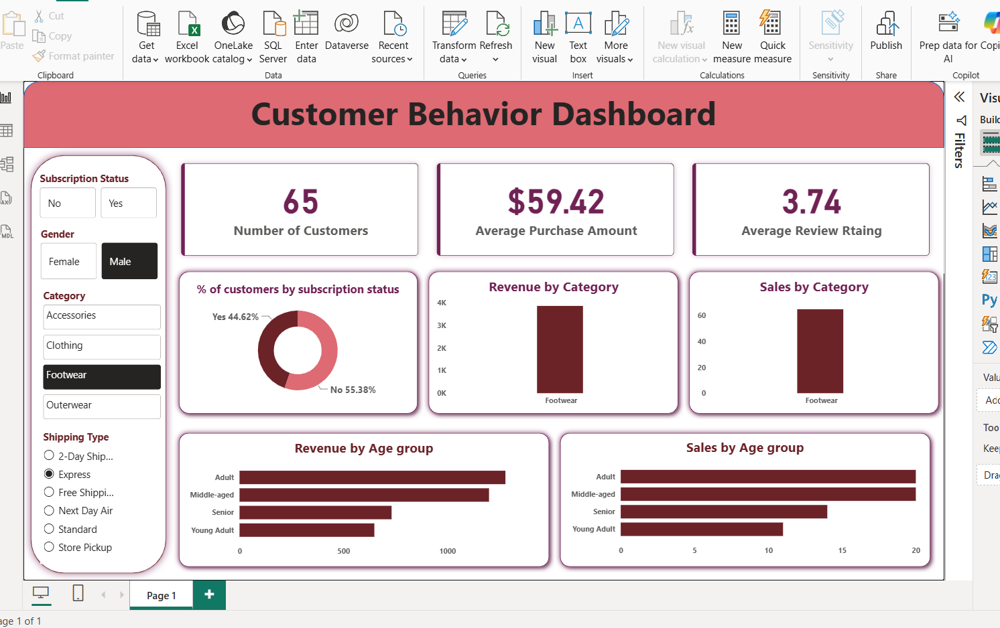
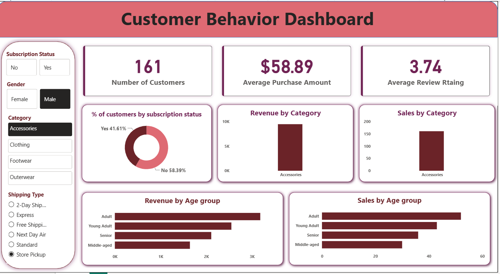

# 🛍️ Customer Shopping Behavior Analysis

## 📌 Overview

This project analyzes customer shopping behavior to uncover purchasing trends, customer preferences, and revenue-driving factors. The analysis combines Python for data processing, MySQL for querying, and Power BI for interactive business dashboards.


## Dataset

- Source: [Dataset](https://github.com/Rishita877/CustomershoppinBehaviour_analysis/blob/a99a31b1d3f443e9777d96cb2edae9f80ccdcf40/customer_shopping_behavior.csv)
- Format: CSV
- Description: The dataset contains structured data used for performing data analysis and visualization.
  

## 🛠 Tools & Technologies
- Python
- Jupyter Notebook
- MySQL
- Power BI
- Git & GitHub


## Project Workflow

#### 1. Data Loading
- Imported the dataset using Python.
- Checked data types and basic information.
- Identified missing values and duplicate records.
    
#### 2. Exploratory Data Analysis (EDA)
- Analyzed data distribution and summary statistics.
- Explored relationships between variables.
- Created visualizations to identify trends and patterns.
    
#### 3. Data Cleaning
- Removed duplicate records.
- Handled missing values.
- Corrected inconsistent data formats.
- Prepared the dataset for analysis.
    
#### 4. SQL Analysis
- Imported the cleaned dataset into MySQL.
- Wrote SQL queries to:
  - Retrieve filtered data
  - Perform aggregations
  - Group records
  - Sort and rank results
  - Generate analytical insights
    
#### 5. Power BI Dashboard

Built an interactive dashboard featuring:

  - KPI Cards
  - Trend Analysis
  - Category-wise Performance
  - Interactive Filters and Slicers
  - Charts and Visualizations
    


## Dashboard

The Power BI dashboard provides an interactive overview of the dataset, allowing users to explore trends, compare performance metrics, and gain actionable insights through dynamic visualizations.











## Results

The project helped uncover meaningful insights by:

- Identifying important trends and patterns
- Highlighting key performance indicators (KPIs)
- Improving data quality through preprocessing
- Presenting insights in an interactive and easy-to-understand dashboard


## 📂 Project Structure

```text
Data-Analytics-Project/
│
├── Dataset/
│   └── dataset.csv
│
├── Python/
│   └── analysis.ipynb
│
├── SQL/
│   └── queries.sql
│
├── PowerBI/
│   └── dashboard.pbix
│
├── Images/
│   └── dashboard.png
│
└── README.md
```

## Key Skills Demonstrated

- Data Cleaning
- Exploratory Data Analysis (EDA)
- SQL Querying
- Data Visualization
- Dashboard Development
- Business Insight Generation

  

## 👩‍💻 Author

**Rishita Baranwal**

Aspiring Data Analyst • Designer • Data Visualization Enthusiast

⭐ If you found this project useful, consider starring the repository!
